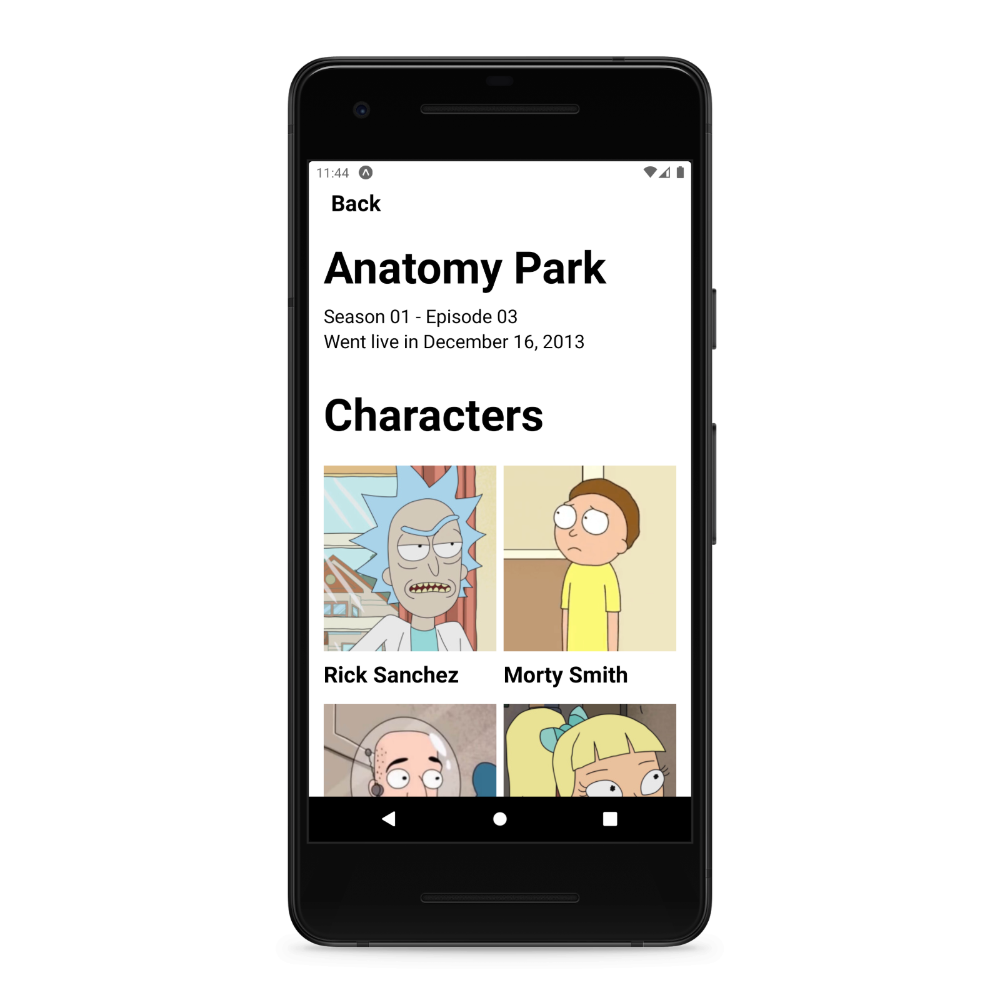

# Rick and Morty

## Table of Contents
- [Motivation](#motivation)
- [Technical Stack](#technical-stack)
- [UI Showcase](#ui-showcase)

## Motivation

As a fan, this project was created to display simple and useful information about the Rick and Morty show. Including information about seasons, episodes, characters and maybe more.

## Technical Stack
- [GraphQL (URQL)](https://formidable.com/open-source/urql/)
- [Typescript](https://www.typescriptlang.org/)
- [Expo](https://expo.dev/)
- [Styled Components](https://styled-components.com/)
- [Rick and Morty API](https://rickandmortyapi.com/)

## UI Showcase

---

Made with 💜 and javascript

